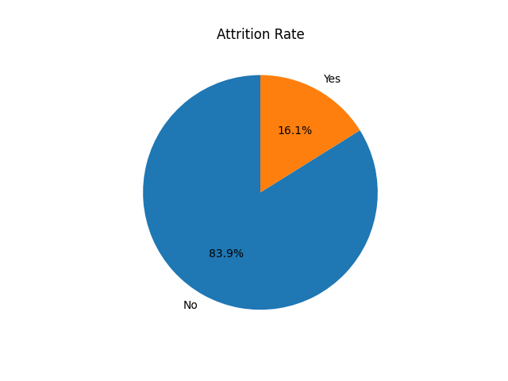
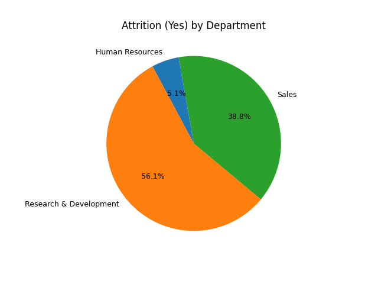
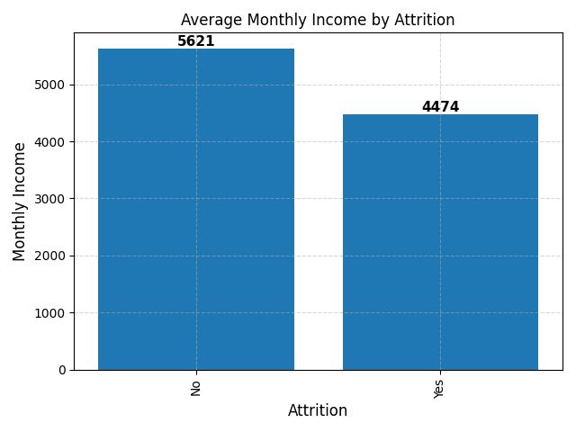
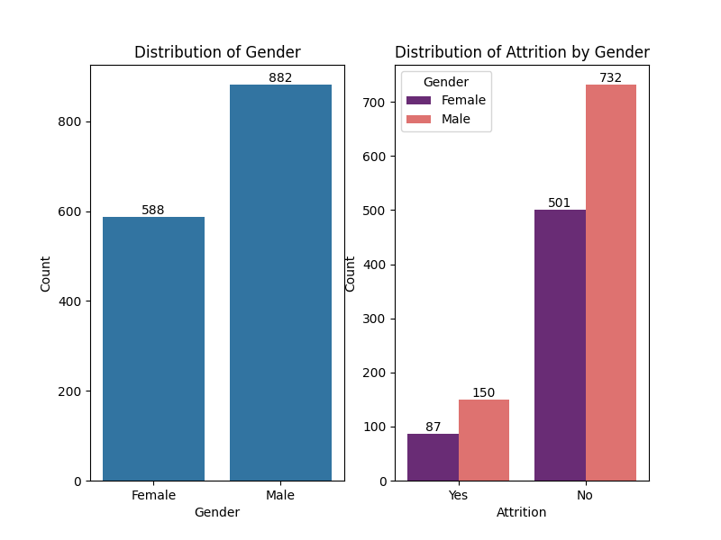

# Employee Attrition Analysis


An end-to-end exploratory data analysis of employee attrition, built as a university capstone project. The goal: identify which factors most strongly predict whether an employee leaves, and translate those findings into actionable retention recommendations for HR leadership.

---

## Business Problem

High employee attrition is costly — recruiting, onboarding, and lost productivity can amount to 50–200% of an employee's annual salary per departure. This project investigates the underlying drivers of attrition across departments, income levels, overtime patterns, and gender to help HR teams make targeted, evidence-based retention decisions rather than blanket policy changes.

---

## Dataset

- **Source:** IBM HR Analytics Employee Attrition dataset
- **Format:** `employee.xls` — 1,470 employee records across 35 attributes
- **Key fields:** `Attrition`, `Department`, `OverTime`, `MonthlyIncome`, `Gender`, `JobRole`, `Age`, `YearsAtCompany`

---

## Methodology

### 1. Data Loading & Quality Check
- Loaded raw employee records and audited for missing values and duplicates
- Printed shape, null counts, and duplicate rows to quantify data quality before any cleaning

### 2. Outlier Removal (IQR Method)
- Applied the Interquartile Range method across all numeric columns
- Values falling more than 1.5×IQR outside Q1/Q3 replaced with NaN for controlled imputation (rather than deletion, preserving sample size)

### 3. Missing Value Imputation
- Filled NaN values (including outlier replacements) with the column **median**
- Median chosen over mean for robustness against skewed income and tenure distributions

### 4. Duplicate Removal
- Verified and removed duplicate rows, confirming counts before and after

### 5. Exploratory Analysis & Visualisation
Five targeted analyses were run to answer specific business questions:

| Analysis | Question answered |
|---|---|
| Overall attrition rate | What percentage of staff are leaving? |
| Attrition by department | Which department has the biggest retention problem? |
| Attrition by overtime | Do employees working overtime leave at a higher rate? |
| Income vs attrition | Is pay a significant driver of departure? |
| Attrition by gender | Is there a gender disparity in attrition? |

---

## Key Findings

### Overall Attrition Rate


### Attrition by Department


Sales showed the highest share of attrition, followed by Human Resources — indicating that high-pressure, target-driven environments carry greater turnover risk.

### Attrition by Overtime
Employees working overtime left at a significantly higher rate than those who did not — suggesting workload management is a stronger lever for retention than compensation alone.

### Average Monthly Income by Attrition


Employees who left earned a lower average monthly income than those who stayed — confirming that below-market pay is a material attrition risk, particularly in lower job levels.

### Attrition by Gender


---

## Recommendations

Based on the findings, three retention levers were identified for HR leadership:

1. **Overtime policy** — Introduce mandatory overtime thresholds and compensatory time-off; target departments with the highest overtime-to-attrition correlation first
2. **Salary benchmarking** — Conduct market-rate review for roles with below-average income among leavers, prioritising Sales and junior job levels
3. **Departmental focus** — Invest in targeted engagement programmes for Sales and HR, the two departments with the highest attrition share

---

## Project Structure

```
.
├── attrition-analysis.py   # Full analysis pipeline: cleaning → EDA → visualisation
├── employee.xls            # Raw HR dataset (1,470 records)
├── attrition-report.pdf    # Executive summary report
└── Graphs/
    ├── attritionrate.png       # Overall attrition pie chart
    ├── Attrition_Dept.png      # Attrition by department
    ├── attrition_income.png    # Monthly income vs attrition
    ├── attrition_gender.png    # Gender breakdown
    └── attrition_matrix.png    # Correlation matrix
```

---

## Tech Stack

| Tool | Purpose |
|---|---|
| Python 3.11 | Analysis runtime |
| pandas | Data loading, cleaning, grouping |
| NumPy | IQR outlier calculation |
| Matplotlib | Charts and layout |
| seaborn | Gender distribution countplots |

---

## Running the Project

```bash
# Install dependencies
pip install pandas numpy matplotlib seaborn openpyxl

# Run the analysis (generates all charts)
python attrition-analysis.py
```

---

## License

MIT
